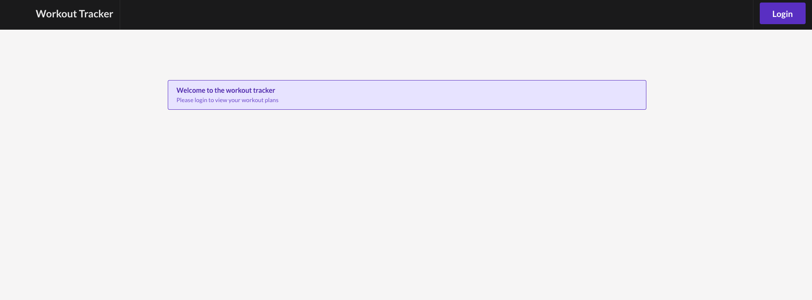
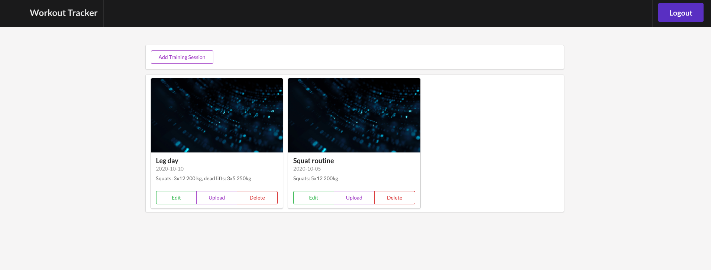

# Workout Logger App
This repository contains the workout logger app: a frontend implemented with React.js and a serverless backend for AWS.
The app allows to add training session items that contain the basic informations about each training day and an image.
The code is split into two folders: frontend contains the React.js frontend and backend contains the serverless backend.

# Deployment

### Backend

To deploy the application navigate into the backend folder and run the following commands:

```
npm install
sls deploy -v
```

### Running the forntend on localhost

To run the frontend on localhost:3000 navigate into the frontend folder and execute the following in the terminal

```
npm start
```

This should start a development server with the React application that will interact with the serverless backend on aws.






